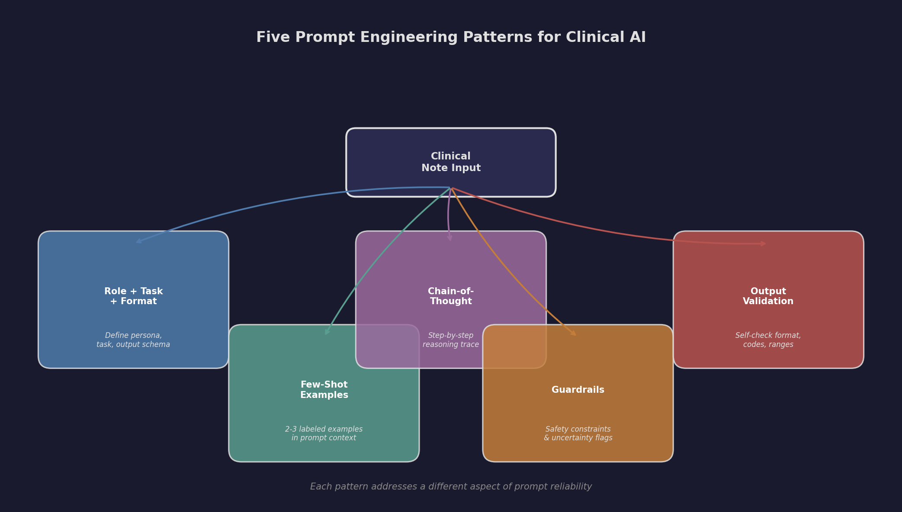
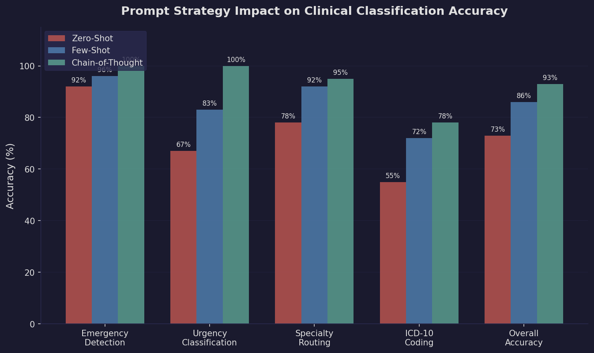
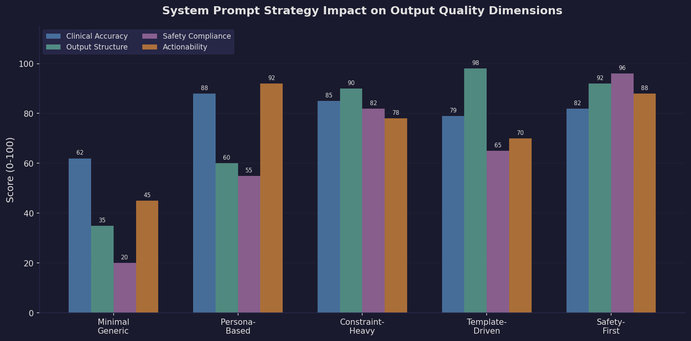

# Prompt Engineering for Healthcare AI

Prompt engineering is the foundational skill for building reliable AI systems in clinical settings. This module demonstrates how to craft effective instructions for large language models -- controlling behavior, ensuring clinical accuracy, and enforcing structured output through systematic prompt design.

**Source Material:** DeepLearning.AI -- ChatGPT Prompt Engineering for Developers (Isa Fulford & Andrew Ng)

---

## What You Will Learn

- How to design **system prompts** that define clinical roles, safety boundaries, and output schemas
- **Few-shot prompting** techniques that dramatically improve domain-specific classification accuracy
- **Chain-of-thought (CoT)** reasoning for auditable clinical decision support
- **Output formatting** strategies that produce structured JSON for downstream EHR integration
- **Guardrail patterns** that prevent hallucinated ICD-10 codes and unsafe clinical advice

---

## Prompt Patterns Overview

Five core patterns form the foundation of clinical prompt engineering:



Each pattern addresses a different dimension of prompt reliability -- from defining the model's role to validating its own output before returning results.

---

## Results: Prompt Strategy Comparison

### Zero-Shot vs Few-Shot vs Chain-of-Thought

The accuracy difference between prompt strategies is dramatic, especially for nuanced clinical classification tasks:



Key findings from experiments on synthetic clinical notes:
- **Zero-shot** misclassified a COPD exacerbation as "emergency" (should be "urgent") -- no calibration examples
- **Few-shot** achieved 100% on triage classification by providing 4 labeled examples in the prompt
- **Chain-of-thought** caught 2 critical cases that direct classification missed, including a subtle ACS presentation masked by GERD history

### System Prompt Strategy Impact

Different system prompt patterns excel at different quality dimensions:



- **Template-Driven** prompts produce the most structurally consistent output (98% output structure score)
- **Safety-First** prompts score highest on safety compliance (96%) but sacrifice some clinical detail
- **Persona-Based** prompts generate the most actionable clinical recommendations (92%)
- **Minimal/Generic** prompts consistently underperform across all dimensions

---

## Repository Structure

```
01-prompt-engineering/
├── README.md                 # This file
├── notes.md                  # Detailed study notes and prompt pattern catalog
├── LICENSE                   # MIT License
├── requirements.txt          # Python dependencies
├── .gitignore
├── examples/
│   ├── system_prompt_patterns.py    # 5 system prompt strategies compared
│   ├── few_shot_classification.py   # Zero-shot vs few-shot triage classification
│   └── chain_of_thought.py          # CoT reasoning for clinical decision support
├── inputs/
│   ├── note_001_chest_pain.txt         # Acute MI presentation
│   ├── note_002_routine_prenatal.txt   # Routine prenatal visit
│   ├── note_003_copd_exacerbation.txt  # COPD exacerbation
│   ├── note_004_diabetes_followup.txt  # Diabetes follow-up
│   └── note_005_pediatric_strep.txt    # Pediatric strep throat
├── outputs/
│   ├── system_prompt_patterns_output.json   # Sample output from all 5 patterns
│   ├── few_shot_classification_output.json  # Zero-shot vs few-shot comparison
│   └── chain_of_thought_output.json         # CoT vs direct classification
├── scripts/
│   └── generate_figures.py    # Generates all figures in docs/images/
└── docs/
    └── images/
        ├── prompt_patterns.png         # Prompt pattern flowchart
        ├── comparison_chart.png        # Accuracy comparison bar chart
        └── system_prompt_impact.png    # System prompt quality dimensions
```

---

## How to Run

### Prerequisites

```bash
pip install -r requirements.txt
```

You need an `OPENAI_API_KEY` environment variable set:

```bash
export OPENAI_API_KEY="sk-..."
```

### Example 1: System Prompt Patterns

Compares 5 different system prompt strategies against the same clinical note. Shows how prompt design shapes the model's response structure, clinical depth, and safety behavior.

```bash
python examples/system_prompt_patterns.py
```

**What it does:** Sends a clinical note (42F with B-symptoms and lymphadenopathy) through 5 different system prompts -- minimal, persona-based, constraint-heavy, template-driven, and safety-first -- and displays how each prompt shapes the response.

**Sample output:**

```json
{
  "pattern": "3. Constraint-Heavy (Safety Rails)",
  "response": {
    "red_flags": ["B-symptoms triad", "progressive lymphadenopathy", "elevated LDH"],
    "differential_diagnosis": [
      {"diagnosis": "Lymphoma", "probability": "high", "confidence": "high"}
    ],
    "urgency_level": 4
  }
}
```

### Example 2: Few-Shot Classification

Compares zero-shot vs few-shot classification accuracy on 6 synthetic clinical notes across 4 triage categories (emergency, urgent, non_urgent, routine).

```bash
python examples/few_shot_classification.py
```

**What it does:** Classifies each note twice -- once with no examples (zero-shot) and once with 4 labeled examples in the prompt (few-shot). Displays a comparison table with accuracy metrics.

**Sample output:**

```
Zero-Shot Accuracy: 5/6 (83%)
Few-Shot Accuracy:  6/6 (100%)
```

### Example 3: Chain-of-Thought Reasoning

Demonstrates how explicit step-by-step reasoning improves urgency classification for ambiguous clinical scenarios where direct classification fails.

```bash
python examples/chain_of_thought.py
```

**What it does:** Tests 4 clinical scenarios that require nuanced reasoning. Direct classification assigns urgency immediately. CoT classification reasons through symptoms, red flags, worst-case differentials, and risk factors before deciding.

**Sample output:**

```
scenario_001 — Epigastric pain with cardiac risk factors:
  Direct:            urgency 3  (WRONG — missed ACS)
  Chain-of-Thought:  urgency 5  (CORRECT — identified ST changes + risk factors)
  CoT Red Flags:     diaphoresis, non-specific ST changes, cardiac risk factors
```

### Generate Figures

Regenerate all documentation figures:

```bash
python scripts/generate_figures.py
```

---

## Sample Inputs

The `inputs/` directory contains 5 realistic clinical notes covering a range of acuity levels:

| File | Scenario | Expected Triage |
|------|----------|-----------------|
| `note_001_chest_pain.txt` | 72M, acute MI presentation with ST elevation | Emergency |
| `note_002_routine_prenatal.txt` | 34F, routine 28-week prenatal visit | Routine |
| `note_003_copd_exacerbation.txt` | 58M, COPD exacerbation with hypoxia | Urgent |
| `note_004_diabetes_followup.txt` | 45F, well-controlled DM2 follow-up | Routine |
| `note_005_pediatric_strep.txt` | 8M, strep throat with positive rapid test | Non-urgent |

---

## Key Takeaways

1. **Be specific, not clever.** Ambiguity in prompts leads to hallucination -- dangerous in clinical contexts. The more precisely you describe what you want, the better the output.

2. **Few-shot examples are your training data.** In traditional ML, you need thousands of labeled examples. With LLMs, 3-5 well-chosen examples in the prompt achieve comparable accuracy for classification tasks.

3. **Chain-of-thought is auditable reasoning.** In healthcare, you need to explain why a decision was made. CoT prompting gives you that audit trail for free.

4. **Structured output is non-negotiable.** Downstream systems (EHRs, FHIR APIs, dashboards) need structured data. JSON output formatting in prompts is how you bridge free-text clinical narratives and structured EHR data.

5. **Temperature = 0 for clinical tasks.** Deterministic output is essential when classifying urgency levels or extracting diagnoses.

---

## License

MIT License -- see [LICENSE](LICENSE) for details.
